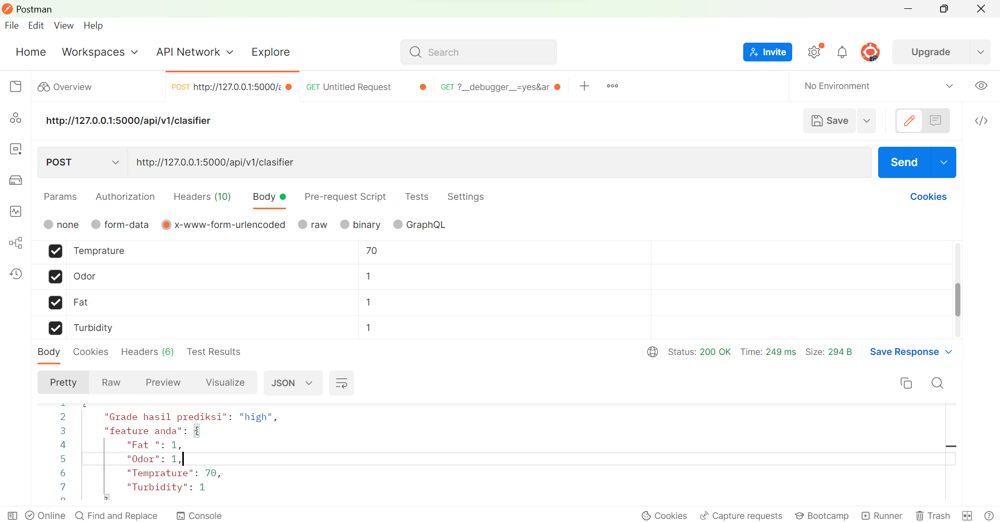

# Milk Grade
## How to Use
### 1) Clone Repo
```bash
git clone https://github.com/RivalHaikalHafizh/mental-helps.git
```
### 2) Install library
```bash
pip install -r requirements.txt
```
### 3) Run!
```bash
flask run
```

or

```bash
flask run
```
## API

